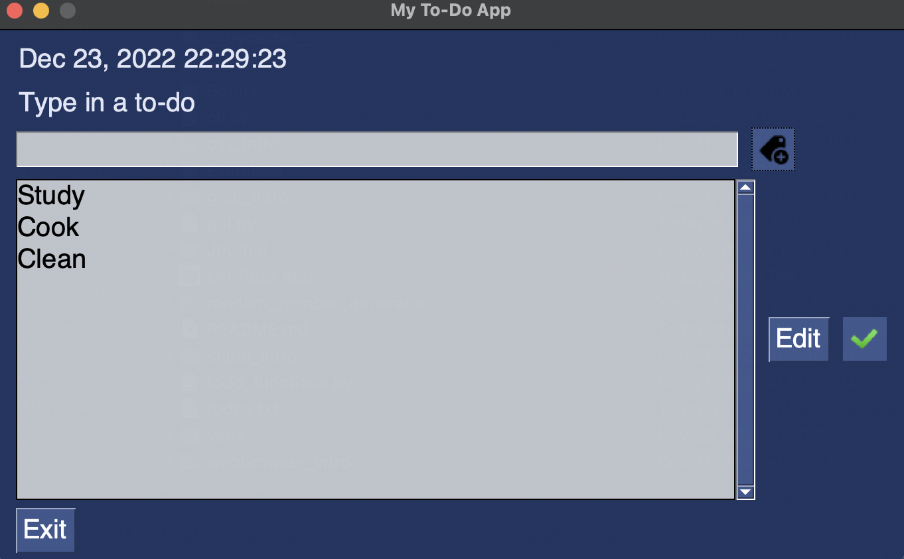

# Todo List Application

 

## <u>Table of Contents</u>

1. [Description](#Description)
2. [Installation](#Installation)
3. [Usage](#Usage)
4. [Contributing](#Contributing)
5. [Authors](#Authors)
6. [License](#License)

## Description

Todo List Application is a program that helps users keep track of tasks in an easy to use and read place. The user is
able to either use the application on their command line with the CLI application, or use the standalone executable
application, which they can execute on their local machines. Currently, the standalone application can only be used on
macOS operating systems.

The application allows the user to add new items to the Todo list, edit previously created items, and remove/complete
the items from the list. This functionality can be done using both versions of the application, Version 1.0 being the
command line tool, while Version 3 being the application via the Graphical User Interface (GUI). For both versions, the
todos list is saved to a todos.txt file, which is created on first use, and updated on every use thereafter.

### Dependencies

This application was made using Python and a number of third party and standard modules. Both versions of the
application use the time standard python module to display the date and time when the application is run. The GUI
application displays and updates the time in real-time.

The GUI application uses some additional libraries. It uses the os standard python module to create the .txt file on the
first execution of the program. It also uses PySimpleGUI, which is a third party module used to create the
graphical user interface for users to interact with.

## Installation

To install this application to your Mac, simply clone or download the repository files on to your local machine. This
will create a folder which contains the application file. From here, users can either use the CLI program, or the GUI
program. These usages are explained below. Note, to run the programs via the command line, the user must have Python3
installed on their local machine.

## Usage

There are two primary ways to use this application. The easiest way is to run the standalone executable application
file. This will be an application file found in the project directory called My Todo App. This will open the graphical
user interface for this application.

The other way to run this application on your local machine is to run it via the command line. This requires Python3 to
be installed on your local machine. Once you clone, or download, the project repository onto your local machine.
Navigate to the root directory of the project via the command line and run the following command:

### CLI Application

```commandline
python3 cli.py
```

This will execute the command line interface application and allow you to use Version 1 of the application. The methods
and functionality of the application are very easy to use and understand and can all be done via the command line.

### GUI Application

```commandline
python3 gui.py
```

This is one way to execute the GUI application. This is done via the command line, similar to how the CLI application is
run. This will run the program and the GUI will appear on your local machine.

The other way to run the GUI application is to simply execute the standalone application, which is found in the root
directory of the project when it is cloned/downloaded from this repository. Simply click on the My Todo App icon and
start keeping track of your tasks!

The following is an image of the GUI:



## Contributing

We are always looking to improve your application and code, so if you wish to contribute, please create a repository and
push all changes you make to it. Then email me at charanvir123@gmail.com, and I will try to get back to you after I have
reviewed the code.

## Authors

To view more projects visit my [GitHub](https://github.com/Charanvir) account.

Direct any additional questions you have regarding this application to charanvir123@gmail.com

# License

The following application is covered under the MIT License.